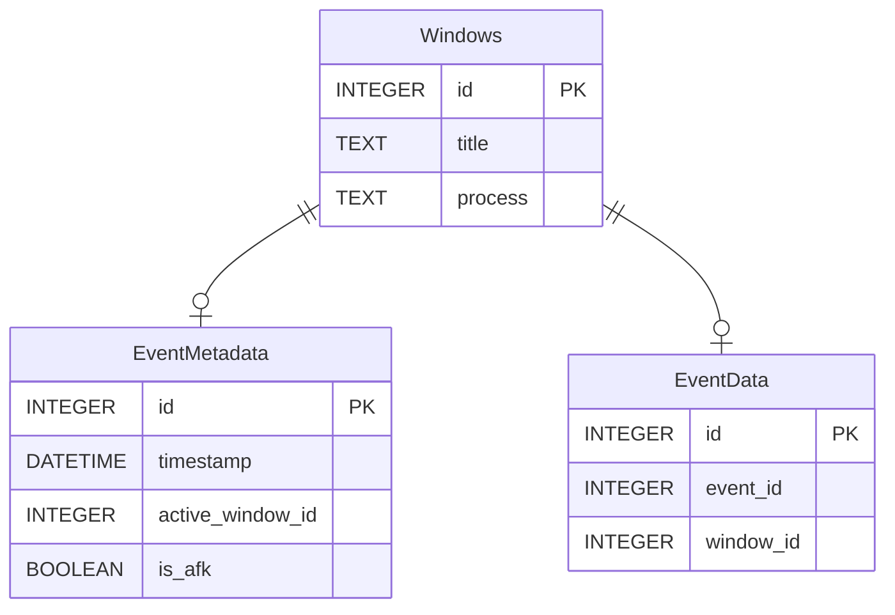

###### The data is maintained in a simple Sqlite3 database, the schema of which is described below.

```mermaid
erDiagram
    Windows {
        INTEGER id PK
        TEXT title
        TEXT process
    }

    EventMetadata {
        INTEGER id PK
        DATETIME timestamp
        INTEGER active_window_id
        BOOLEAN is_afk
    }

    EventData {
        INTEGER id PK
        INTEGER event_id
        INTEGER window_id
    }

    Windows ||--o| EventMetadata : ""
    Windows ||--o| EventData : ""
```

